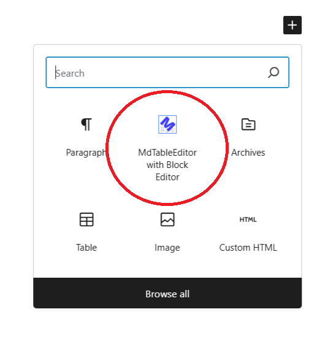
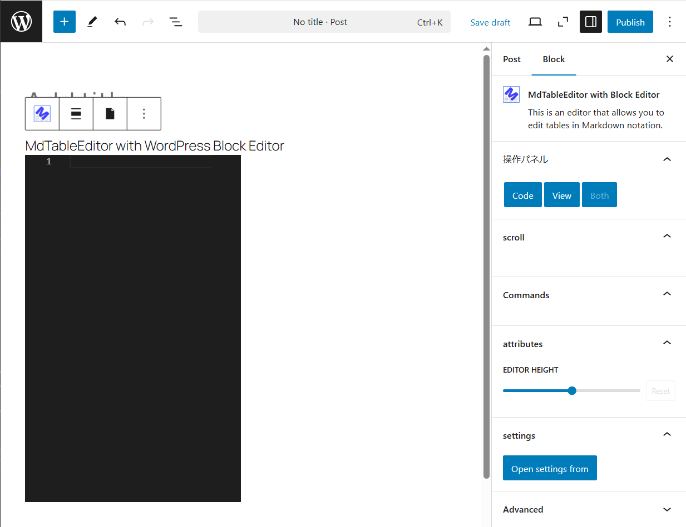
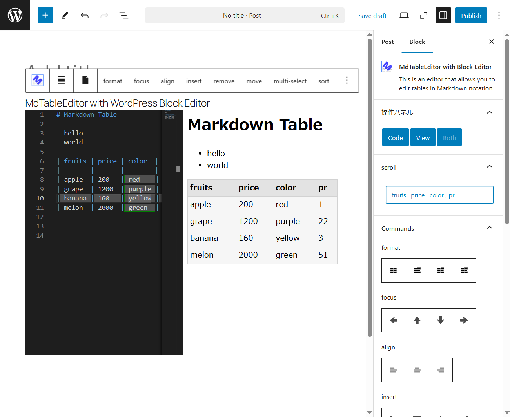
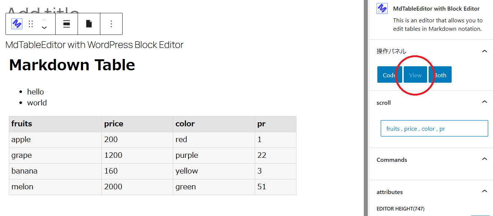
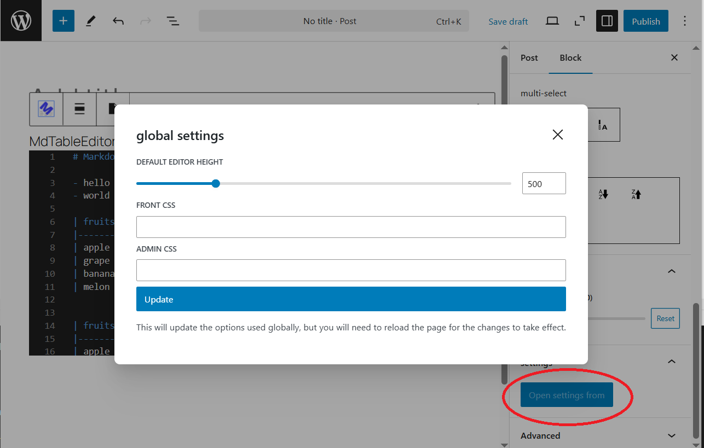
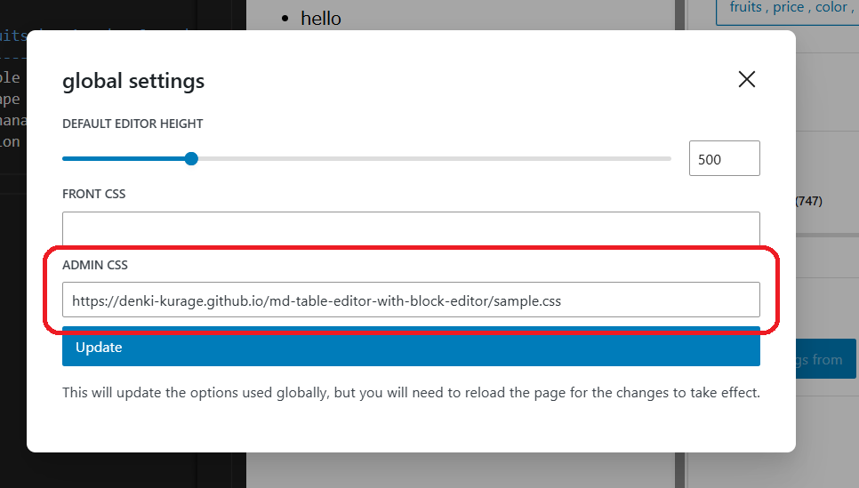
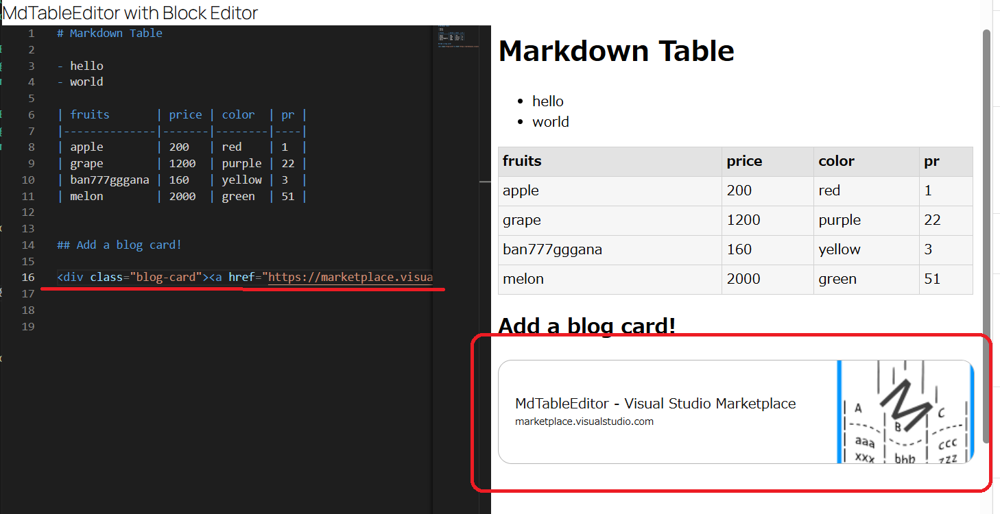

# MdTableEditor with Block Editor

ブロックエディタでマークダウン表記のテーブルを編集できます。
元々はVSCodeの拡張機能として作っていたMdTableEditorをWordPressに移植したものです。

以下はVSCode拡張機能 MdTableEditor

https://marketplace.visualstudio.com/items?itemName=clover.md-table-editor


## 出来ること。

このブロックを使用すると、マークダウン形式のテーブルで表を作成、編集できます。
列や行の追加、削除、移動、テキストの整列、成形などマークダウンテーブルの編集を一通りできます。


## 使い方

基本的な使い方はMdTableEditorをご覧ください(一部使えない機能あり)。

https://marketplace.visualstudio.com/items?itemName=clover.md-table-editor




ブロックエディタを追加します。




追加された状態です。


行の先頭カラムで`4x`と入力すると補完機能が使用できます。


`4x4`を実行すると、横縦が共に4つあるテーブルが作成されます。
ビューを表示したい場合は補完中に「`ctrl` + `space`」を押します。




テーブルのサンプルです。
左側がVSCodeで使われているエディタ、右側が確認画面です。


テーブル編集に特化したブロックエディタですが、最低限画像を追加することができます。


確認画面に画像が表示されているのが確認できます。




エディタのモードをviewにすると、確認画面のみ表示します。


エディタのモードをcodeにすると、エディタのみ表示します。


マークダウン中に複数のテーブルがあるとリスト化され、ボタンをクリックするとテーブルへスクロールすることができます。


エディタの高さを個別に設定することができます。
ここで高さを設定無効にすると、デフォルト設定の高さが使用されます。
デフォルト設定は次のグローバルの設定で行います。



グローバル設定では、本来管理画面で行うような設定をインスペクタからできるようになります。

エディタのデフォルトの高さや、マークダウンが出力するHTMLのスタイルシートを設定できます。

- デフォルトのエディタの高さ
- ブロックエディタの確認画面のスタイル
- フロントエンドのスタイル


## マークダウンのスタイルを指定したい。

グローバル設定からスタイルを設定可能です。

デフォルトではプラグインディレクトリに「markdown.css」というファイルがあり、それが使用されています。

* 何故か WordPress Playgroynd ではデフォルトのCSSファイルが使用できません。

マークダウンのDOMはフロントエンド、バックエンド共に`div.markdown-content-style`以下に配置されます。
よってSASSでは以下のようにデザインします。


    markdown.scss

```scss
.markdown-content-style
{

    TABLE
    {
        width: 100%;
    }

    TABLE, TH, TD
    {
        border: 1px solid rgb(210, 210, 210);
        border-collapse: collapse;
        padding: .3em;
    }

    TH
    {
        background-color: rgb(227, 227, 227);

        // THはデフォルトでCENTERに並ぶので、--- だと中央に位置してしまいます。
        // それでは実態と異なるので ---指定の場合はCSSレベルで左寄せします。
        // 
        // ---  ->  <TH>
        // :--  ->  <TH align="left">
        &:not([align])
        {
            text-align: left;
        }
    }

    TD
    {
        background-color: rgb(246, 246, 246);
    }
}
```

*このSCSSは今後変更される可能性があります。
最新のSCSSはGitHubにあります。

https://github.com/denki-kurage/md-table-editor-with-block-editor/blob/main/markdown.scss


CSSに変換しウェブ上に配置した後、グローバル設定で指定することでマークダウンのスタイルを変更できます。


### 実例

実例をあげます。

    sample.scss

```scss
.markdown-content-style
{
    TABLE
    {
        width: 100%;
    }

    TABLE, TH, TD
    {
        border: 2px solid rgb(255, 117, 117);
        border-collapse: collapse;
        padding: .3em;
    }

    TH
    {
        background-color: rgb(255, 237, 237);

        &:not([align])
        {
            text-align: left;
        }
    }

    TD
    {
        background-color: rgb(246, 246, 246);
    }
    
}
```

CSSへ変換後、適当な場所にアップロードします。

    https://denki-kurage.github.io/md-table-editor-with-block-editor/sample.css




ADMIN CSS はブロックエディタの確認画面に適用されるスタイルで、
FRONT CSS は一般公開されたページに適用されるスタイルです。


ブラウザを更新するとスタイルが適用されていることが確認できます。


### コードから確認画面にスタイルを指定

```php
add_action(
    'admin_head',
    fn() => printf('<meta property="is-markdown-content-style" content="%s" />', plugin_dir_url(__FILE__) . 'test.css')
);
```

メタ情報に、porpertyをis-markdown-content-styleを、contentにCSSを指定すると、そのスタイルを確認画面に適用します。


## ブログカードを追加したい


ツールバーからブログカードを追加できます。
ただし、そのサイトがOGP(Open Graph Protocol)に対応している必要があります。
現在のところ、対応していない場合は良しなに扱ってくれません。




ブログカードのタグが追加されます。


## ソースコードのハイライト

Prism.jsが使用されてます。


## ご要望等。

気が向けば対応することもあります！
実務経験の無い素人プログラマなので難易度の高い要件には対応出来ないです。


## 開発者について

趣味でC#やってます！


