# MdTableEditor with Block Editor

You can edit tables written in Markdown with the block editor.

Originally created as a VSCode extension, MdTableEditor has been ported to WordPress.

Below is the VSCode extension MdTableEditor

https://marketplace.visualstudio.com/items?itemName=clover.md-table-editor


## What it can do.

This block allows you to create and edit tables in Markdown format.

It allows you to do all the editing of Markdown tables, such as adding, deleting, and moving columns and rows, and aligning and shaping text.


## How to use

For basic usage, please see MdTableEditor (some functions may not be available).

https://marketplace.visualstudio.com/items?itemName=clover.md-table-editor

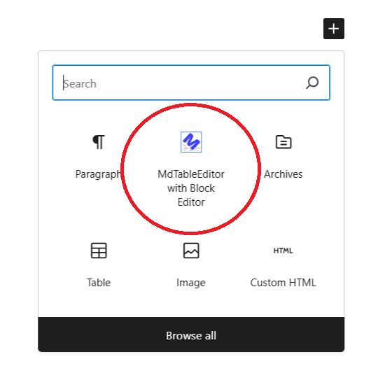

Adds a block editor.


Added state.

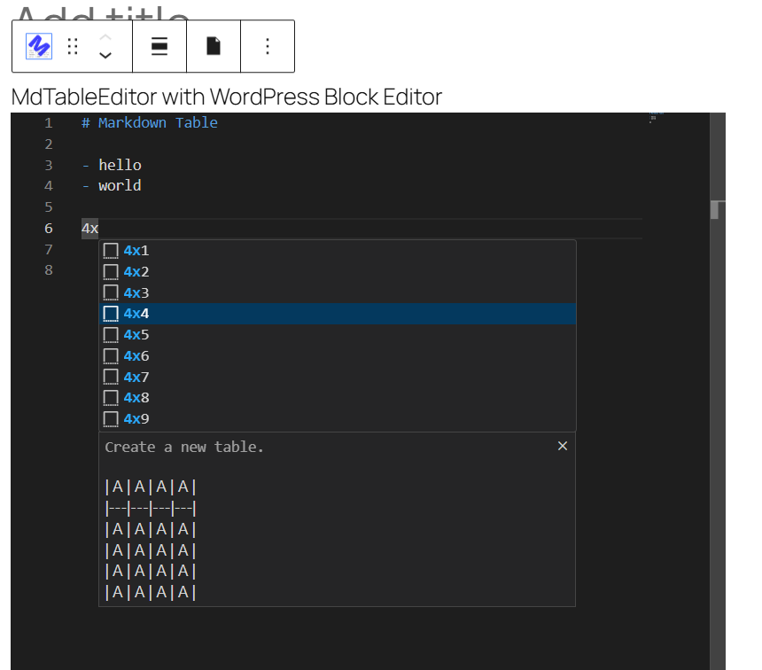

You can use the completion function by entering `4x` in the first column of a line.

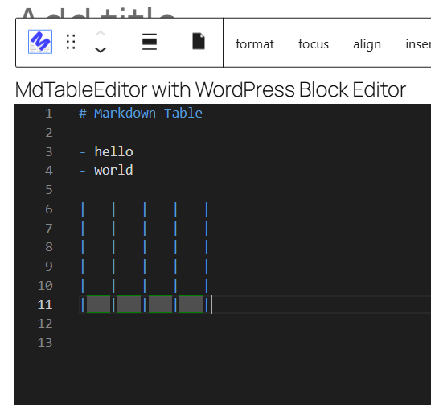

Executing `4x4` creates a table with four rows and four columns.
If you want to display the view, press `ctrl` + `space` during completion.


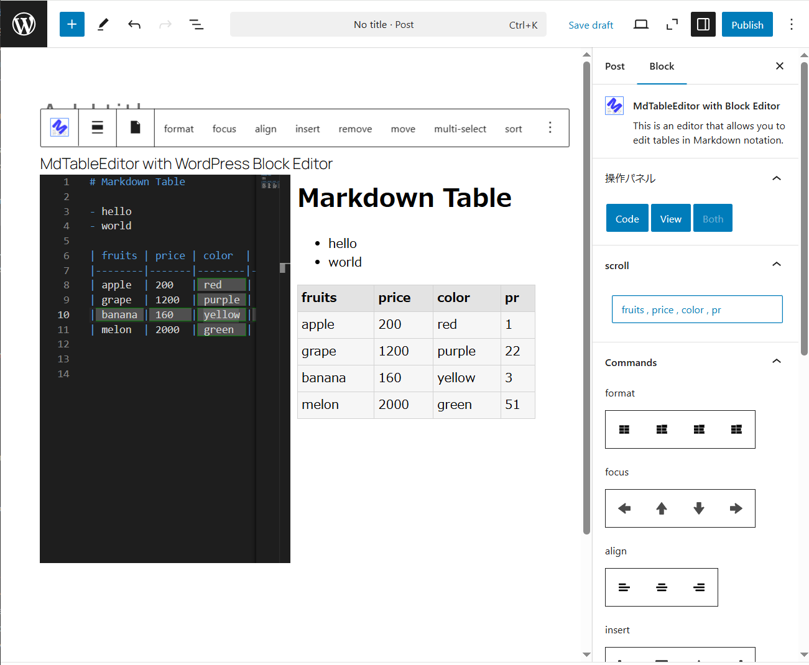

A sample table.
The editor used in VSCode is on the left, and the confirmation screen is on the right.

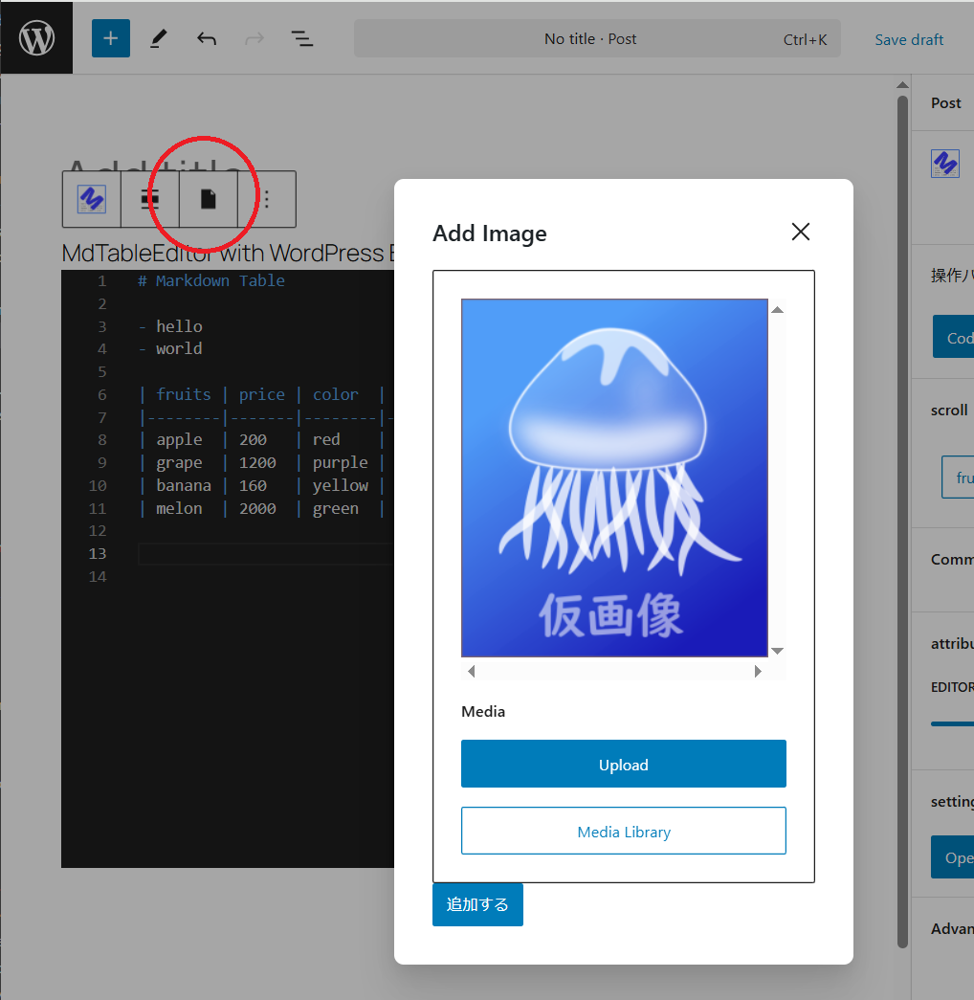

This is a block editor specialized for table editing, but you can add images at a minimum.

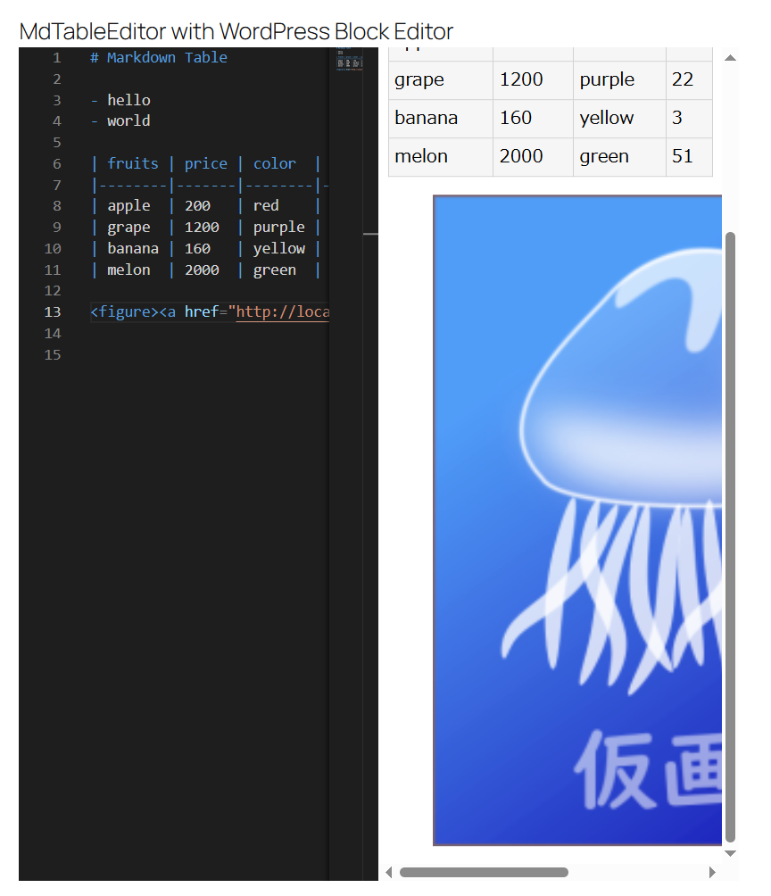

You can see the image displayed on the confirmation screen.

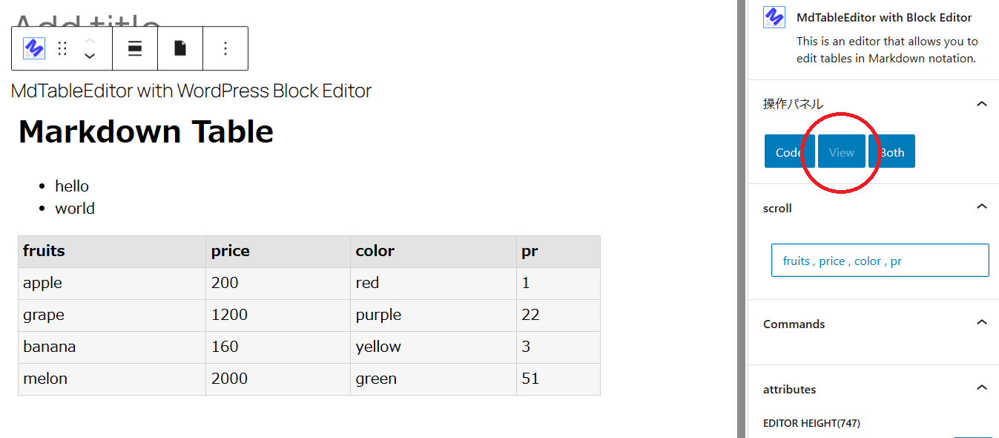

When the editor mode is set to view, only the confirmation screen is displayed.

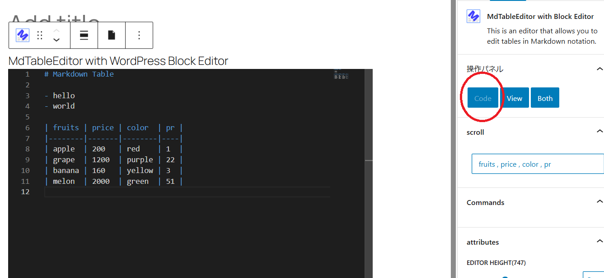

When the editor mode is set to code, only the editor is displayed.

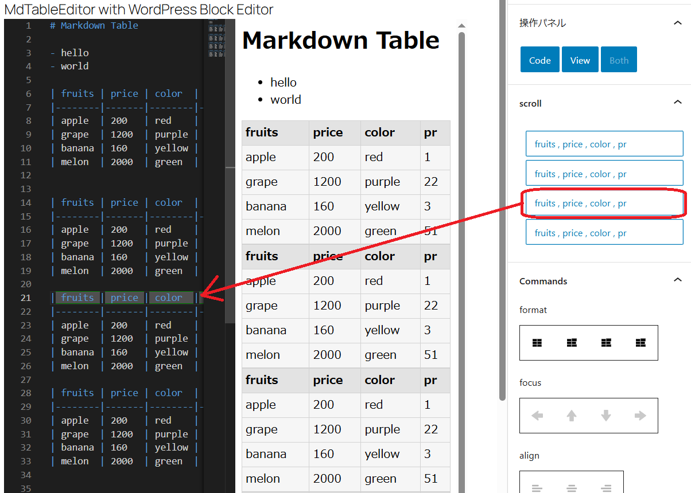

When there are multiple tables in the markdown, they are listed, and you can scroll to the tables by clicking the button.


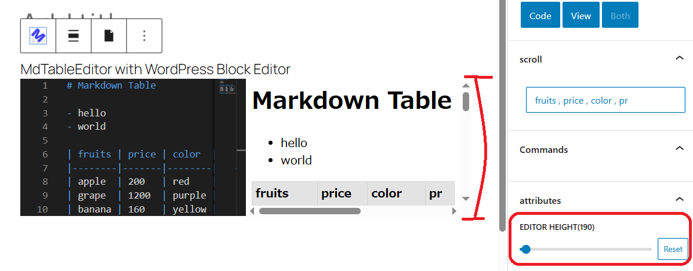

You can set the height of the editor individually.

If you disable the height setting here, the default height will be used.

The default setting is set in the following global settings.

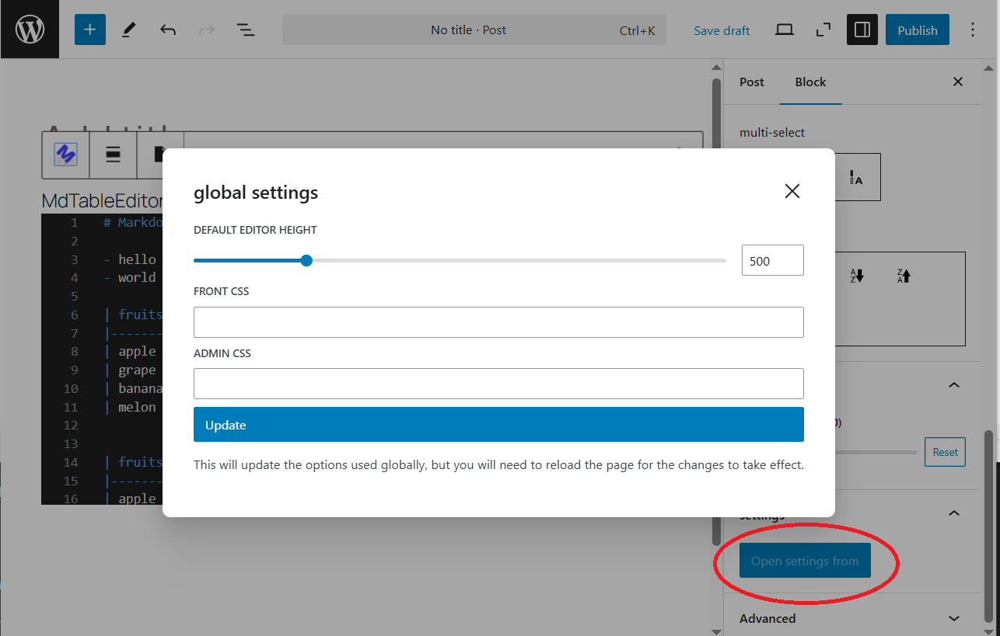

In the global settings, you can set the settings that would normally be done in the admin screen from the inspector.

You can set the default height of the editor and the style sheet of the HTML that Markdown outputs.

- Default editor height
- Block editor confirmation screen style
- Front-end style


## Specify the Markdown style.

You can set styles from global settings.

By default, there is a file called "markdown.css" in the plugin directory, and that is used.

* For some reason, WordPress Playgroynd cannot use the default CSS file.

The Markdown DOM is placed under `div.markdown-content-style` on both the frontend and backend.

Therefore, you should design it in SASS as follows.

    markdown.scss

```scss
.markdown-content-style
{

    TABLE
    {
        width: 100%;
    }

    TABLE, TH, TD
    {
        border: 1px solid rgb(210, 210, 210);
        border-collapse: collapse;
        padding: .3em;
    }

    TH
    {
        background-color: rgb(227, 227, 227);

        // THはデフォルトでCENTERに並ぶので、--- だと中央に位置してしまいます。
        // それでは実態と異なるので ---指定の場合はCSSレベルで左寄せします。
        // 
        // ---  ->  <TH>
        // :--  ->  <TH align="left">
        &:not([align])
        {
            text-align: left;
        }
    }

    TD
    {
        background-color: rgb(246, 246, 246);
    }
}
```
* This SCSS may change in the future.
The latest SCSS can be found on GitHub.

https://github.com/denki-kurage/md-table-editor-with-block-editor/blob/main/markdown.scss


This is the style used by default.
After converting it to CSS and placing it on the web, you can change the Markdown style by specifying it in the global settings.


### Example

Here is an example.

    sample.scss

```scss
.markdown-content-style
{
    TABLE
    {
        width: 100%;
    }

    TABLE, TH, TD
    {
        border: 2px solid rgb(255, 117, 117);
        border-collapse: collapse;
        padding: .3em;
    }

    TH
    {
        background-color: rgb(255, 237, 237);

        &:not([align])
        {
            text-align: left;
        }
    }

    TD
    {
        background-color: rgb(246, 246, 246);
    }
    
}
```


After converting to CSS, upload it to a suitable location.

https://denki-kurage.github.io/md-table-editor-with-block-editor/sample.css

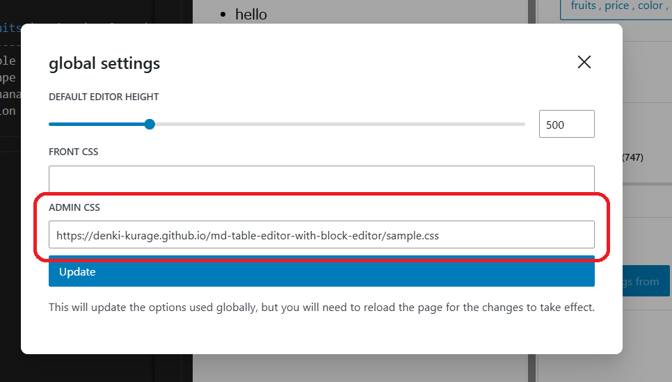

ADMIN CSS is the style applied to the confirmation screen of the block editor,

FRONT CSS is the style applied to the public page.

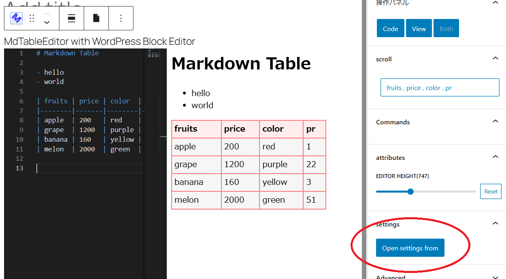

Refresh your browser to see that the style has been applied.


### Specify style for confirmation screen from code

```php
add_action(
'admin_head',
fn() => printf('<meta property="is-markdown-content-style" content="%s" />', plugin_dir_url(__FILE__) . 'test.css')
);
```

If you specify is-markdown-content-style for property and CSS for content in meta information, that style will be applied to the confirmation screen.


## I want to add a blog card

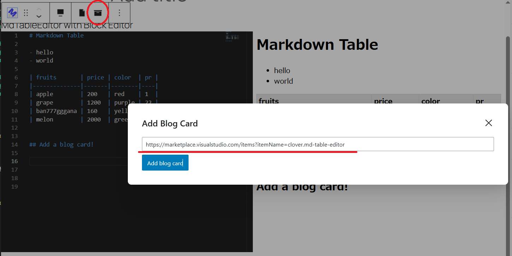

You can add a blog card from the toolbar.
However, the site must support OGP (Open Graph Protocol).
Currently, if the site does not support it, it will not be treated well.

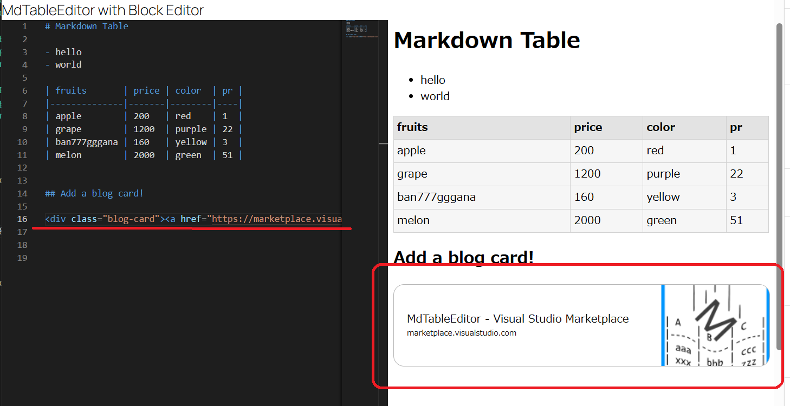

The blog card tag will be added.


## Source code highlighting

Prism.js is used.

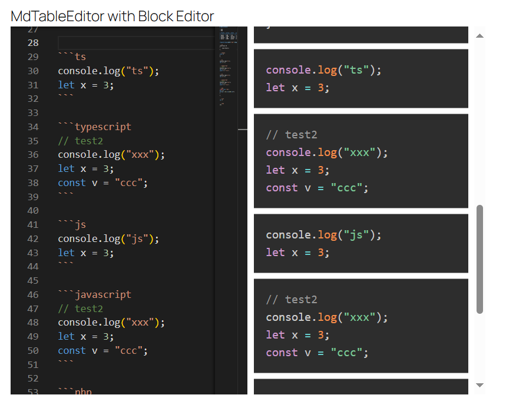


## Requests, etc.

I may respond to your requests if I feel like it!
I am an amateur programmer with no practical experience, so I cannot handle difficult requirements.

## About the developer

I do C# as a hobby!

